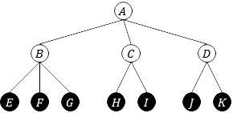

# Task 1: Annotation

In this task we consider a user who wants to know what instruments are played in an audio music file.
Such systems can be used for instance to automatically annotate a music collection, and they can also be used to compute high-level features for other systems such as recommenders. 

## Format

The input to the system is a music audio file. The output is a list of the instruments from the taxonomy deemed relevant to the audio file.

[TBD]

## Evaluation

Several evaluation measures will be used to score a system output for an audio file.
Let $B(e)=\langle b_1,\dots,b_m \rangle$ be the list of instruments predicted by the system for the input audio file $e$, and let $A(e)=\\{a_1,\dots,a_n\\}$ be the set of instruments annotated for the same audio file. 
In addition, let $1[x]$ be an indicator function that evaluates to $1$ if $x$ is true and $0$ otherwise.

### Per-file Flat Measures

Several measures will be used to score a system output for an audio file, ignoring the instrument taxonomy. This means that an instrument $a$ will be relevant for the excerpt $e$ only if $a \in A(e)$ and $a \in B(e)$.:

- **Precision** evaluates the ability of the system to identify instruments without making mistakes (avoid false positives):

  $$P=\frac{1}{m}\sum_{b \in B(e)}{1[b \in A(e)]}.$$

- **Recall** evaluates the ability of the system to identify all instruments present in the input file (avoid false negatives):

  $$R=\frac{1}{n}\sum_{b \in B(e)}{1[b \in A(e)]}.$$

- **F-measure** integrates both Precision and Recall in a single score:

   $$F=2\frac{P\cdot R}{P+R}.$$

- **Average Precision** evaluates the ability of the system to identify all relevant instruments and only those, by estimating the area under the Precision-Recall curve:

  $$AP=\frac{1}{n} \sum_i{ 1[b_i \in A(e)] \cdot \frac{1}{i} \sum_{j=1}^i{ 1[b_j \in A(e)] } }.$$

For each measure, systems will be ranked by mean score over all input files in the corpus (macro-average).

### Per-file Hierarchical Measures

We will also use hierarchical versions of $P$, $R$ and $F$ as defined by Kiritchenko et al. For illustration purposes, assume the instrument class taxonomy in the figure, and assume the annotations $A(e)=\\{F,H\\}$ and the predictions $B(e)=\\{F, I\\}$.

Intuitively, an instrument $a$ will be relevant for the input excerpt $e$ to the extent that it is close in the hierarhcy to the given annotations in $A(e)$. Because our taxonomy has two levels, we define the extended set of annotations $hA(e)=A(e) \cup \bigcup_{a \in A(e)}{ anc(a) }$, and the extended set of prediction $hB(e)=B(e) \cup \bigcup_{b\in B(e)}{ anc(b)}$, where $anc(x)$ returns the ancestor of instrument $x$. In the example, this results in the extended sets $hA(e)=\\{F, B, H, C\\}$ and $B(e)=\\{F, B, I, C\\}$.
With these definitions, the hierarchival measures are similarly defined as:

- **hPrecision**:
  
  $$hP=\frac{1}{|hB(e)|}\sum_{b\in hB(e)}{ 1[b \in hA(e)] }.$$

- **hRecall**:
  
  $$hR=\frac{1}{|hA(e)|}\sum_{b\in hB(e)}{ 1[b \in hA(e)] }.$$

- **hF-measure**:
  
  $$hF=2\frac{hP\cdot hR}{hP+hR}.$$

For each measure, systems will be ranked by mean score over all input files in the corpus (macro-average).

### Per-instrument Flat Measures

Finally, and for the purposes of error analysis, we will also report Precision, Recall and F-measure but for each instrument class rather than each input audio file. In particular, let $q$ be an instrument of the taxonomy, let $B(q)=\\{b_1, \dots, b_m\\}$ be the set of all excerpts for which instrument $q$ was predicted, and let $A(q)=\\{a_1, \dots, a_n\\}$ be the set of all excerpts fow which $q$ is annotated. Per-instrument $P$ and $R$ are therefore:

- **Precision**:
  
  $$P=\frac{1}{m}\sum_{b \in B(e)}{1[b \in A(e)]}.$$

- **Recall**:

  $$R=\frac{1}{n}\sum_{b \in B(e)}{1[b \in A(e)]}.$$

## References

- S. Kiritchenko, S. Matwin, R. Nock and A.F. Famili (2006). [Learning and evaluation in the presence of class hierarchies: Application to text categorization](https://pdfs.semanticscholar.org/9c4d/f411b3adb61556d37331df933256de0ce196.pdf). *Canadian Conference on Artificial Intelligence*.